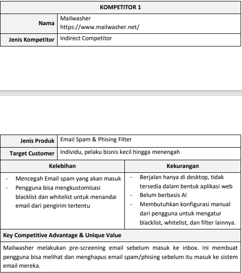
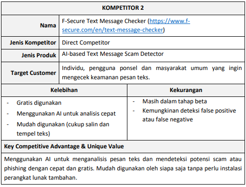
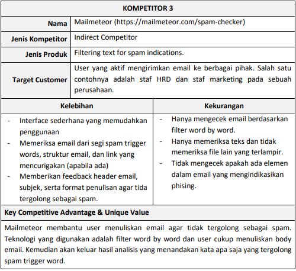

# Team B1_03

**Anggota 1** : Melvin Waluyo - 22/492978/TK/53972

**Anggota 2** : Ryan Krishandi Lukito - 22/497249/TK/54488

**Anggota 3** : Rizkita Alisha Ramadhani - 22/494942/TK/54347

*Project Senior Project TI*

*Departemen Teknik Elektro dan Teknologi Informasi, Fakultas Teknik, Universitas Gadjah Mada*

Nama Produk:
**DeceptiScan**

Jenis Produk:
**Web-based Spam and Phising Classifer**

## Latar Belakang

Pada era digital saat ini, internet telah menjadi bagian tak terpisahkan dari kehidupan
sehari-hari. Pengguna semakin sering berinteraksi dengan berbagai platform online,
termasuk email, media social, dan situs web untuk keperluan komunikasi, transaksi, hingga
akses informasi. Namun, seiring dengan kemajuan teknologi, ancaman keamanan siber
seperti spam dan phishing juga semakin berkembang dan menjadi tantangan serius bagi
individu maupun Perusahaan.
Spam merupakan pesan yang dikirim secara massal dengan tujuan mengganggu,
mempromosikan produk tanpa izin, atau bahkan menyebarkan malware. Sementara itu,
phishing adalah Teknik manipulasi yang digunakan oleh penyerang untuk mencuri
informasi pribadi, seperti kredensial login, nomor kartu kredit, atau data sensitive lainnya,
dengan menyamar sebagai entitas yang sah melalui email, pesan teks, atau situs web
palsu.
Menurut laporan dari Statista (2024), sekitar 45,6% dari total email yang dikirim di seluruh
dunia pada tahun 2023 dikategorikan sebagai spam, meskipun terjadi penurunan dari
hampir 49% pada tahun 2022. Selain itu, insiden phishing juga menunjukkan peningkatan
yang signifikan. Pada Desember 2023, sekitar 9,45 juta email phishing terdeteksi secara
global, naik dari 5,59 juta pada September 2023. Banyak pengguna masih kesulitan
membedakan antara email atau tautan yang sah dan yang berbahaya, menyebabkan
mereka menjadi korban pencurian data dan serangan siber lainnya.
Dari latar belakang tersebut ada beberapa permasalahan di masyarakat khususnya di
dunia digital yang harus diselesaikan pada era sekarang ini. Permasalahan terkait
banyaknya berita/email spam dan juga phising sering kali merugikan banyak orang. Untuk
menemukan dan merancang solusi dari permasalahan tersebut dengan memanfaatkan
teknologi, kita bisa menjabarkan rumusan permasalahannya terlebih dahulu sebagai
berikut 

## Rumusan Masalah

1. Bagaimana kita bisa membedakan email spam dan email yang sah?
2. Bagaimana kita bisa membedakan email phising dan email yang valid?
3. Bagaimana memastikan sistem pendeteksi memiliki akurasi yang tinggi dan mampu
   membantu pengguna untuk terhindar dari scam/phising?
4. Bagaimana kita menampilkan hasil deteksi dari sistem yang dibuat secara informatif
   kepada pengguna?

## Solusi

Solusi yang kelompok kami berikan adalah pengembangan website untuk pengecekan
spam text dan email phising. Website bekerja dengan cara menerima input dari user
berupa teks yang akan dicek validitasnya kemudian mengeluarkan hasil berupa indikasi
apakah teks yang dimasukkan user tergolong spam atau tidak spam serta phising atau
tidak phising. Selain itu, web ini juga akan dilengkapi dengan artikel berita terkait
bagaimana cara agar tidak tertipu pesan spam ataupun phising.

## Analisis Kompetitor:

Kompetitor 1:

Kompetitor 2:

Kompetitor 3:

